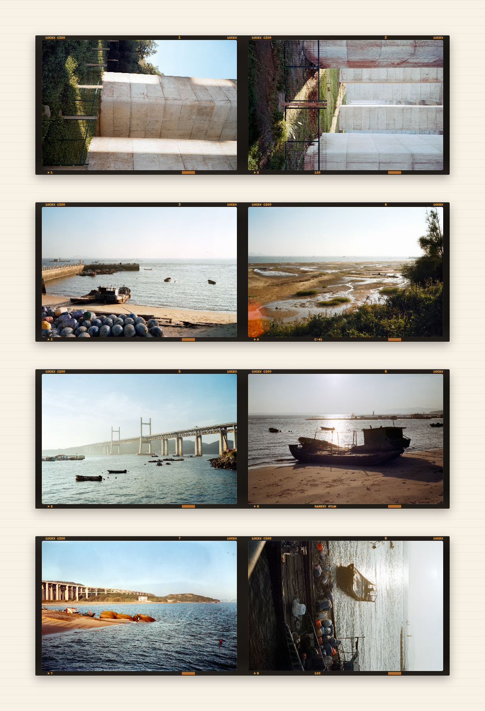

# 海带索引图 FILM

一个纯前端胶片索引图（contact sheet）生成器。把扫描后的单张底片图片整理为 135、半格、120 中画幅的索引图。图片只在浏览器本地处理，不上传服务器。

<p align="center">
  
</p>

## 索引图示例

<table>
  <tr>
    <th align="center">135 底片</th>
    <th align="center">6×6 中画幅</th>
    <th align="center">6×9 中画幅</th>
  </tr>
  <tr>
    <td align="center" width="33%"></td>
    <td align="center" width="33%"></td>
    <td align="center" width="33%"></td>
  </tr>
  <tr>
    <th align="center" colspan="3">XPan 135 宽幅（65×24mm）</th>
  </tr>
  <tr>
    <td align="center" colspan="3"></td>
  </tr>
</table>


## 快速开始

### 1. 在线使用

访问：[https://judian99.github.io/film-index-generator/](https://judian99.github.io/film-index-generator/)

### 2. 下载 Release 压缩包

本项目是纯前端静态网页，无需安装依赖或运行构建命令。

1. 前往 [Releases 页面](https://github.com/Judian99/film-index-generator/releases)，下载最新版本的 ZIP 压缩包。
2. 将压缩包完整解压到本地文件夹。
3. 进入解压后的目录，用浏览器打开 `index.html`。

### 3. 使用 Git Clone

如需获取最新源码或参与开发，可以克隆仓库：

```bash
git clone https://github.com/Judian99/film-index-generator.git
cd film-index-generator
```

然后用浏览器打开 `index.html`。

### 使用方法

1. 点击“选择或拖入扫描件”，或直接把 JPG/PNG/WebP 文件拖入窗口。
2. 等待图片加载完成，自动生成索引图。
3. 使用侧栏调整排版、画幅和胶片外观。
4. 点击“导出索引图”下载 PNG 或 JPG。

## 支持格式

| 画幅 | 比例 | 每行张数 | 方向 | 说明 |
|------|------|---------|------|------|
| 135 全画幅 | 36×24mm | 可选择 2–8 | 横图 | 默认选项，带齿孔和边字 |
| 135 宽幅 | XPan 65×24mm / 约 84×24mm | 自动 3 / 2 | 横图 | 通过宽幅规格选择，共享 135 宽幅渲染规则 |
| 半格（单张裁切） | 18×24mm | 固定 12 | 竖图 | 每个文件作为一个竖向半格，片头首行 10 张 |
| 半格（单张未裁切） | 3:2 | 可选择 4–8 | 横图 | 双格扫描文件作为一张完整图片 |
| 6×6 | 56×56mm | 固定 3 | 不限 | 120 中画幅，窄边带、无齿孔 |
| 6×4.5 | 41.5×56mm | 固定 4 | 竖槽 | 照片自动旋转 90° 进槽 |
| 6×7 | 69.5×56mm | 固定 2 | 不限 | 120 中画幅 |
| 6×9 | 84×56mm | 固定 2 | 不限 | 120 中画幅，与 135 宽幅 84×24 不同 |
| 6×12 | 112×56mm | 固定 3 | 不限 | 120 宽幅中画幅 |
| 6×17 | 168×56mm | 固定 2 | 不限 | 120 宽幅中画幅 |


## 编辑单帧

在预览图的某一帧上右键，打开帧操作菜单。

<p align="center">
  
</p>

### 裁切

打开裁切弹窗，拖动四个角调整裁切区域，点击"应用裁切"确认。

<p align="center">
  
</p>

### 旋转

每点击一次将帧顺时针旋转 90°，支持多次旋转。

### 插入

在当前位置前插入一张空白帧，用于占位或标记。

### 导出单帧

在帧操作菜单中选择“导出单帧”，可将当前画面导出为独立的片基单帧图片。输出会沿用当前图片的裁切、旋转和方向处理，并使用当前索引的画幅、胶卷型号、边字、齿孔、宽幅成像覆盖设置以及排序后的帧号。

正式版仅提供片基单帧效果，不包含拍立得或幻灯片片夹样式。弹窗支持 PNG、JPG，以及 1x、2x、3x 和原图级输出；原图级仅支持 PNG。若原图级单帧超过浏览器画布上限，页面会提示改用 3x。

### 删除

从索引图中移除该帧。


## 胶卷型号

### 内置型号(缓慢更新)

提供常见胶卷型号下拉选择，每种型号包含名称、边字字样、冲洗工艺等预设信息。

### 自定义型号

在"自定义型号"面板中可新增、编辑、删除胶卷型号：

- **名称**：显示名称
- **边字字样**：出现在索引图边字区域，留空表示底片无边字
- **冲洗工艺**：C-41 彩色负片、黑白负片、E-6 反转片、ECN-2 电影卷
- **高级外观**：可自定义边字颜色、交替字样、帧号格式

自定义型号保存在浏览器 localStorage 中，支持 JSON 导入导出。

## 隐私说明

- 图片只在浏览器本地读取和绘制，不上传服务器
- 不写入额外元数据
- 自定义型号数据保存在浏览器 localStorage 中，清除浏览器数据会丢失


## 关于作者

- 小红书：3661182800
- 抖音：69530829181
- 邮箱：1946378724@qq.com