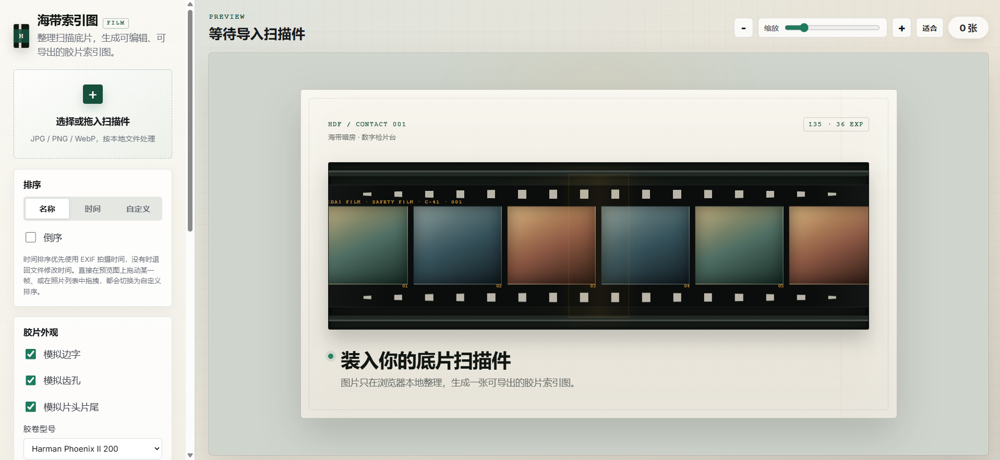
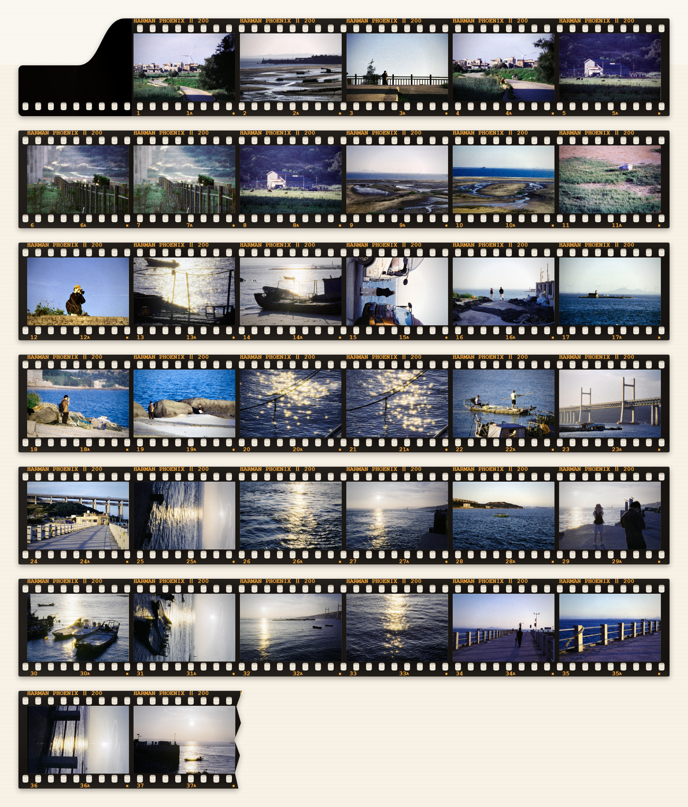
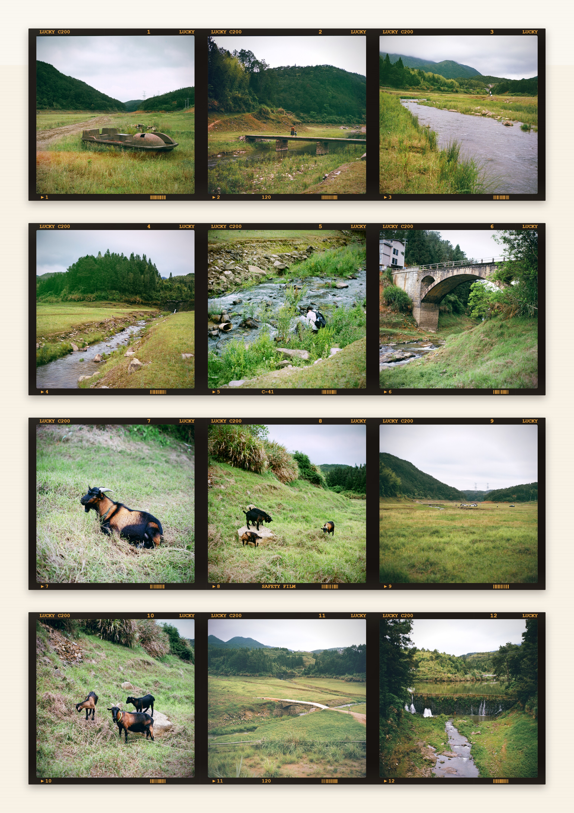
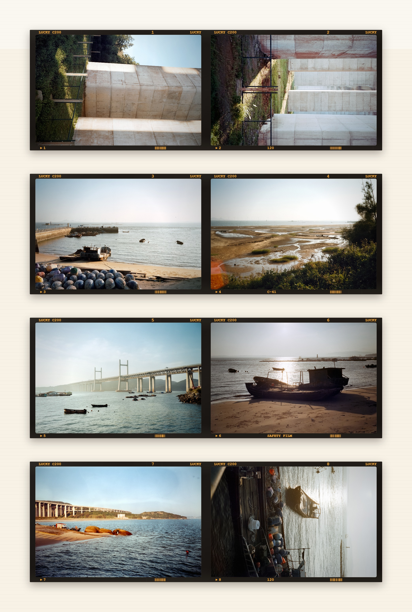
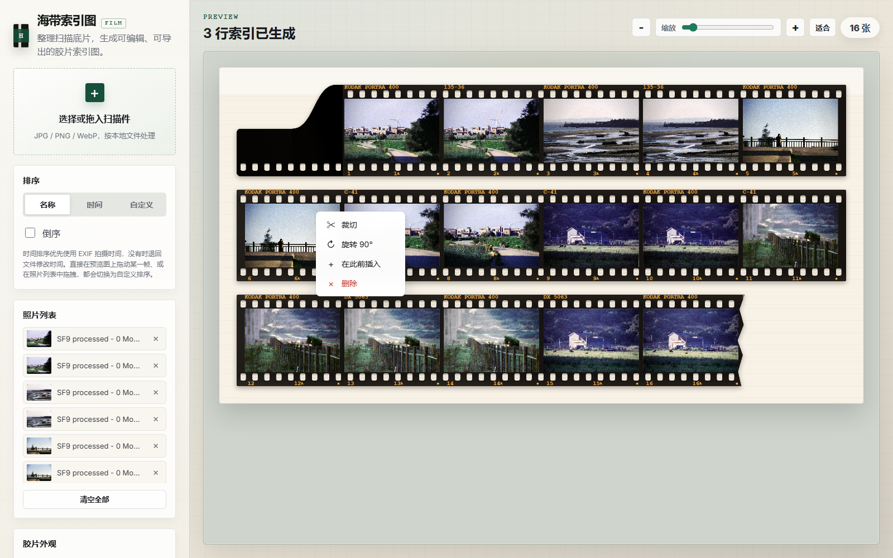
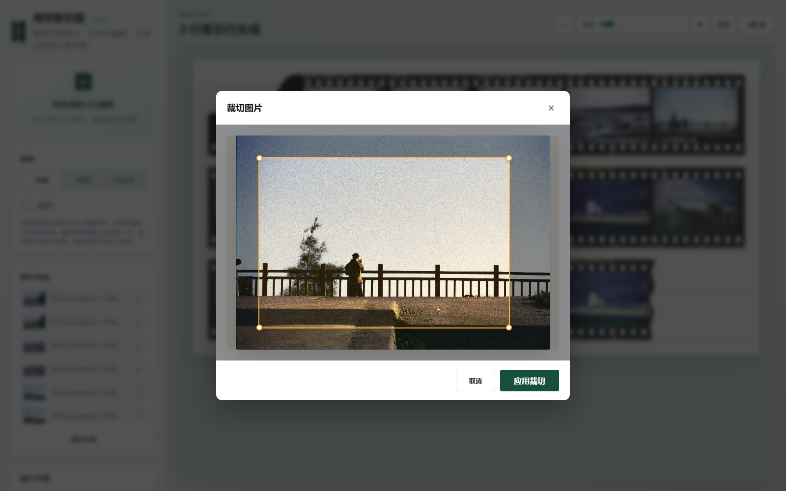
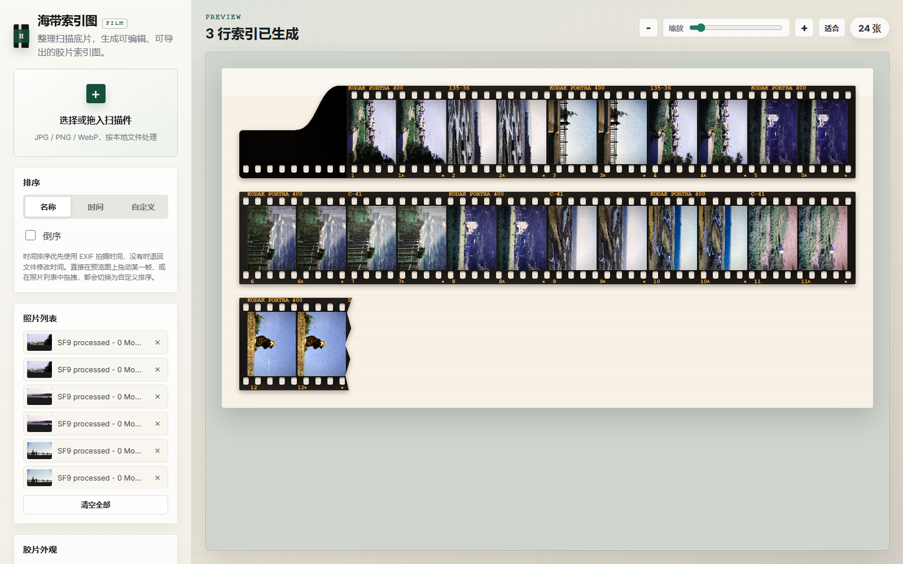
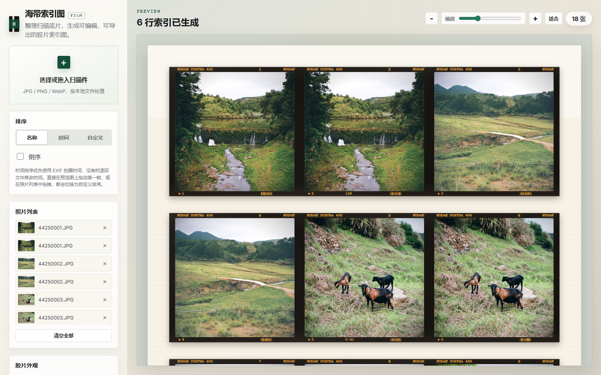

# 海带索引图 FILM

一个纯前端胶片索引图（contact sheet）生成器。把扫描后的单张底片图片整理为 135、半格、120 中画幅的索引图。图片只在浏览器本地处理，不上传服务器。

## 索引图示例

---
## 快速开始

1. 用浏览器打开 `index.html`
2. 点击"选择或拖入扫描件"，或直接把 JPG/PNG/WebP 文件拖入窗口
3. 等待图片加载完成，自动生成索引图
4. 使用侧栏调整排版、画幅、胶片外观
5. 点击"导出索引图"下载 PNG 或 JPG
---
## 界面总览

左侧控制面板包含所有设置项，右侧预览区实时显示索引图效果。

- **顶部栏**：显示当前状态、预览缩放控制、照片计数
- **预览区**：生成的索引图，可缩放和平移
- **侧栏面板**：导入、排序、画幅、胶片外观、输出设置

--- 

## 支持格式

| 画幅 | 比例 | 每行张数 | 方向 | 说明 |
|------|------|---------|------|------|
| 135 全画幅 | 3:2 | 可选择 2–8 | 横图 | 默认选项，带齿孔和边字 |
| 半格（单张裁切） | 3:4 | 固定 12 | 竖图 | 每个文件作为一个竖向半格，片头首行 10 张 |
| 半格（单张未裁切） | 3:2 | 可选择 4–8 | 横图 | 双格扫描文件作为一张完整图片 |
| 6×6 | 1:1 方画幅 | 固定 3 | 不限 | 120 中画幅，窄边带、无齿孔 |
| 6×4.5 | 竖幅 | 固定 4 | 竖槽 | 照片自动旋转 90° 进槽 |
| 6×7 | 横图 | 固定 2 | 不限 | 120 中画幅 |
| 6×9 | 横图 | 固定 2 | 不限 | 120 中画幅 |

## 导入与照片管理

### 导入图片

支持批量导入和分批追加。点击空白区域或拖拽文件到窗口即可。支持 JPG、PNG、WebP 格式，不支持的格式会提示跳过。

### 图片处理

- 自动读取 EXIF 方向信息，无需手动旋转
- 自动等比居中裁切，保持画面比例
- 图片只存在浏览器内存中，**不会上传到任何服务器**

### 移除图片

- 在预览图或照片列表上右键打开菜单，可删除单张图片
- 点击"清空全部"按钮移除所有图片

### 排序

- **名称排序**：按文件名排序
- **时间排序**：优先使用 EXIF 拍摄时间（DateTimeOriginal），没有时退回文件修改时间
- **自定义排序**：在预览图上直接拖动某一帧，或在照片列表中拖拽，都会自动切换为自定义排序
- **倒序**：勾选后可反转排序结果

## 编辑单帧

在预览图的某一帧上右键，打开帧操作菜单。

### 裁切

打开裁切弹窗，拖动四个角调整裁切区域，点击"应用裁切"确认。

### 旋转

每点击一次将帧顺时针旋转 90°，支持多次旋转。

### 插入

在当前位置前插入一张空白帧，用于占位或标记。

### 删除

从索引图中移除该帧。

## 半格模式

半格有两种输入模式，可在选则画幅为"半格"后切换：

- **单张裁切（默认）**：将每个文件视为一个竖向半格，普通行固定 12 张，片头首行 10 张，保持标准六格 135 条带尺寸
- **单张未裁切**：将包含双格的横向扫描文件作为一张完整 3:2 图片，不自动拆分，可按全幅规则选择每行 4–8 张

切换模式时图片会从稳定原图重新处理，不会累计自动旋转。

---

## 中画幅

120 中画幅（6×6、6×4.5、6×7、6×9）使用独立参数分支：

- 窄边带、极小帧间隙
- 平切的条带端头（极小圆角）
- 默认无齿孔、无片头片尾（仅 ECN-2 电影卷保留齿孔）
- 每行张数固定
- 边字按帧对齐，上边带"型号 + 帧号 + 品牌词"，下边带"▶ 箭头帧号 + 交替字样 + DX 条码刻线"

---

## 胶片外观

### 模拟边字

可开关的模拟胶片边字，与齿孔分区排布：

- 上边带：型号字样
- 下边带：帧号与帧界标记

边字外观由选择的胶卷型号和冲洗工艺决定。

### 模拟齿孔

按 135 规格连续排列的模拟齿孔，可开关。

### 片头片尾

模拟胶片开头和末尾的引导部分，可开关。

### 高级设置

"高级设置"菜单（默认收起）提供滑块实时调整齿孔和边字的渲染比例，实时作用于预览和导出。

---

## 胶卷型号

### 内置型号(缓慢更新)

提供常见胶卷型号下拉选择，每种型号包含名称、边字字样、冲洗工艺等预设信息。

### 自定义型号

在"自定义型号"面板中可新增、编辑、删除胶卷型号：

- **名称**：显示名称
- **边字字样**：出现在索引图边字区域，留空表示底片无边字
- **冲洗工艺**：C-41 彩色负片、黑白负片、E-6 反转片、ECN-2 电影卷
- **高级外观**：可自定义边字颜色、交替字样、帧号格式

自定义型号保存在浏览器 localStorage 中，支持 JSON 导入导出。

---

## 预览与导出

### 导出设置

- **单张宽度**：索引图每张图片的宽度（像素），范围 180–1200
- **输出质量**：标准 1x、精细 2x、超精细 3x
- **格式**：PNG（无损）或 JPG（可调质量）
- **JPG 质量**：70–100 可调

导出时系统会校验画布尺寸是否超过浏览器上限（最大边长和像素面积），超出时会提示降低规格。

## 隐私说明

- 图片只在浏览器本地读取和绘制，不上传服务器
- 不写入额外元数据
- 自定义型号数据保存在浏览器 localStorage 中，清除浏览器数据会丢失